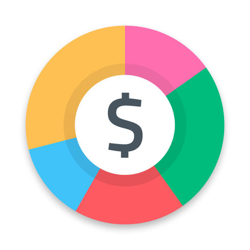

<!-- [![Build Status][build-shield]][build-url]-->
[![LinkedIn][linkedin-shield]][linkedin-url]

<!-- PROJECT LOGO -->
 

  

  <h3 align="center">BudgetTracker</h3>

  

    Manage your budget the right way starting today with BudgetTracker!
     
    <a href="https://github.com/kinzaahmed-web/budgetproject"><strong>Explore the docs »</strong></a>
     
     
    <a href="https://my-budgettracker.herokuapp.com/">Use BudgetTracker</a>
    ·
    <a href="https://github.com/kinzaahmed-web/budgetproject/issues">Report Bug</a>
    ·
    <a href="https://github.com/kinzaahmed-web/budgetproject/issues">Request Feature</a>
  

<!-- TABLE OF CONTENTS -->

  
Table of Contents

  <ol>
    <li>
      <a href="#about-the-project">About The Project</a>
      <ul>
        <li><a href="#built-with">Built With</a></li>
      </ul>
    </li>
    <li><a href="#roadmap">Roadmap</a></li>
    <li><a href="#contributing">Contributing</a></li>
    <li><a href="#contact">Contact</a></li>
  </ol>

<!-- ABOUT THE PROJECT -->
## BudgetTracker

Worried about how to budget? BugetTracker will try to make it easier for you and help show you how much you're spending and you can then determine how to balance your budget. When you use BudgetTracker you decide where your money goes instead of wondering where it all went.

Here's some cool features on BudgetTracker:
* Add Budget projects to separate different accounts or project expenses
* Add Expenses to an individual project
* Designate certain categories for a particular project to help categorize your expenses within a project
* View of all the budget projects a user has
* Graphs to visualize transactions and your overall budget :smile:

### Built With

This Web App was developed using the following tools: 

* [Django](https://www.youtube.com/playlist?list=PL-osiE80TeTtoQCKZ03TU5fNfx2UY6U4p)
* [Bootstrap](https://getbootstrap.com)
* [JQuery](https://jquery.com)
* [PostgreSQL](https://www.postgresql.org/)
* [Heroku](https://www.heroku.com/)

<!-- ROADMAP -->
## Roadmap

See the [open issues](https://github.com/kinzaahmed/budgetproject/issues) for a list of proposed features (and known issues).

<!-- CONTRIBUTING -->
## Contributing

Contributions are what make the open source community such an amazing place to be learn, inspire, and create. Any contributions you make are **greatly appreciated**.

1. Fork the Project
2. Create your Feature Branch (`git checkout -b feature/AmazingFeature`)
3. Commit your Changes (`git commit -m 'Add some AmazingFeature'`)
4. Push to the Branch (`git push origin feature/AmazingFeature`)
5. Open a Pull Request

<!-- CONTACT -->
## Contact

Kinza Ahmed  - kinza1013@yahoo.com

Project Link: [https://github.com/kinzaahmed-web/budgetproject](https://github.com/kinzaahmed-web/budgetproject)

<!-- MARKDOWN LINKS & IMAGES -->
[linkedin-shield]: https://img.shields.io/badge/-LinkedIn-black.svg?style=for-the-badge&logo=linkedin&colorB=555
[linkedin-url]: https://linkedin.com/in/kinzaahmed/
[product-screenshot]: images/Screenshot.png
 
